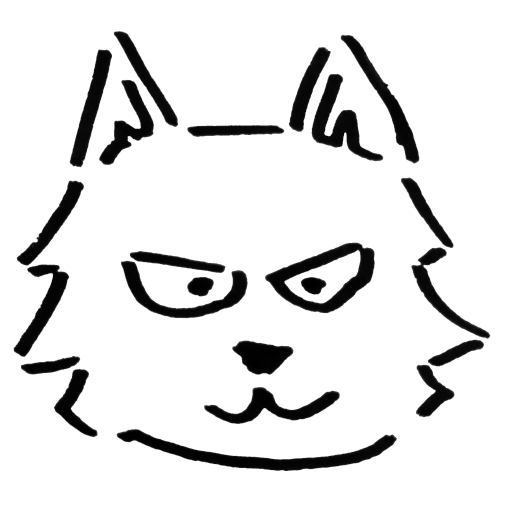
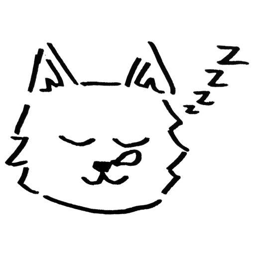

  

  

  In questo capitolo, approfondiremo le tecniche di exploitation in <i>kernel space</i>, con particolare focus su <i>privilege escalation</i>.
   
  Gli exploit del kernel di Windows sfruttano meccanismi di sicurezza hardware e tecniche di <i>privilege escalation</i> simili, quindi le conoscenze acquisite in questo capitolo possono essere applicate anche a sistemi diversi da Linux.
  

- Esecuzione e debug
  - [Introduzione a kernel exploitation](introduction/introduction.html)
  - [Debug del kernel con GDB](introduction/debugging.html)
  - [Meccanismi di sicurezza](introduction/security.html)
  - [Compilare e trasferire gli exploit](introduction/compile-and-transfer.html)
- Fondamenti di kernel exploitation (LK01: Holstein)
  - [Analisi ed exploit del modulo Holstein](LK01/welcome-to-holstein.html)
  - [Holstein v1: Stack Overflow](LK01/stack_overflow.html)
  - [Holstein v2: Heap Overflow](LK01/heap_overflow.html)
  - [Holstein v3: Use-after-Free](LK01/use_after_free.html)
  - [Holstein v4: Race Condition](LK01/race_condition.html)
- Attacchi specifici al kernel
  - [NULL Pointer Dereference (LK02: Angus)](LK02/null_ptr_deref.html)
  - [Double Fetch (LK03: Dexter)](LK03/double_fetch.html)
  - [Usare userfaultfd (LK04: Fleckvieh)](LK04/uffd.html)
  - [Usare FUSE (LK04: Fleckvieh)](LK04/fuse.html)
  - [Usare implementazione di mmap vulnerabile (LK05: Highland) (TODO)](#)
- eBPF e compilatore JIT (LK06: Brahman)
  - [Introduzione a BPF](LK06/ebpf.html)
  - [Checker e compiler JIT](LK06/verifier.html)
  - [Sfruttare un bug in eBPF](LK06/exploit.html)
<!--
- UEFIアプリケーション（LK07: ???）
- TrustZoneとTEE（LK08: ???）
- 付録
  - [buildrootによるカーネルのビルド (工事中)](appendix/buildroot.html)
-->

  

    

      
    

    

      <b>Piccolo lupo</b> 
      La leggenda narra che scalò i ranghi del suo branco per diventarne leader. Nel mondo animale, è un pioniere nello sviluppo di sistemi operativi. Dorme praticamente tutto il giorno.
       
      Apprezza: Manzo / Linux 
      Odia: Iene / Windows
    

  

