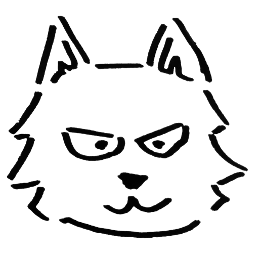

Molti potrebbero sentirsi intimiditi dall'affrontare gli exploit del kernel pensando che questi siano troppo complicati in confronto agli exploit di programmi userspace. In realtà, vedremo che in alcuni casi gli exploit del kernel possono essere sorprendentemente semplici.

In questa sezione spiegheremo le differenze tra gli exploit in userspace e quelli del kernel, oltre a fornire una guida sulla configurazione dell'ambiente di test.

## Caratteristiche dei kernel exploit
Per prima cosa, cerchiamo di capire quali sono le caratteristiche delle vulnerabilità in kernelspace rispetto a quelle in userspace.

### Target dell'attacco.
La differenza più significativa tra gli exploit in userspace e quelli in kernelspace risiede nei loro obiettivi. Gli exploit nello spazio utente affrontati finora hanno generalmente mirato ad *arbitrary command execution*.
D'altra parte, gli exploit nello spazio kernel hanno l'obiettivo di ottenere *privilege escalation*. Supponendo che gli attaccanti siano già riusciti ad infiltrarsi all'interno della macchina bersaglio attraverso qualche mezzo, questi possono usare il kernel exploit per ottenere privilegi di root[^1]. 

Questo tipo di escalation di privilegi su una macchina locale viene chiamato **LPE** (Local Privilege Escalation). Naturalmente, esistono anche vulnerabilità che consentono di ottenere *privilege escalation* anche in userspace, ma questo capita quando il programma bersaglio sta già operando con privilegi elevati.

Nel caso dei kernel exploit, i bersagli dell'attacco sono principalmente i seguenti due:
1. Il kernel Linux stesso
2. Un modulo kernel

Il codice all'interno del kernel Linux (come le syscall o il filesystem) viene eseguito con privilegi di root, quindi se ci sono bug nel kernel stesso, questi potrebbero portare a *privilege escalation*.
Un'altra fonte di vulnerabilità sono i moduli kernel, come i *device driver*. I driver di dispositivo forniscono un'interfaccia per semplificare le interazioni da userspace con dispositivi esterni (come le stampanti). Dato che anche i device driver operano con privilegi di root, se questi contengono bug[^2], possono essere sfruttati per ottenere *privilege escalation* (LPE).

### Metodi di attacco
Nel caso degli exploit in userspace, di solito viene sfruttato un bug nel servizio, inserendo dati malevoli. Il linguaggio preferito per questo tipo di interazione è Python. 
Negli exploit del kernel, i bersagli sono il sistema operativo e i driver.
Le operazioni avvengono a basso livello, e gli exploit vengono scritti in C o similari. Naturalmente è possibile scriverli anche in Python, ma è improbabile che funzionino. È raro che Python sia disponibile sulla macchina bersaglio, come nel caso dei piccoli sistemi Linux usati per le CTF o per ambienti sperimentali. Anche su questo sito, gli exploit verranno scritti in C. Ulteriori dettagli verranno trattati in altre sezioni, ma si userà il compilatore [musl-gcc](https://www.musl-libc.org/).

### Resource sharing
Un'altra caratteristica dei kernel exploit è la condivisione delle risorse. In userland, vi è un solo processo target da sfruttare. Sfruttando il processo vulnerabile si può ottenere una shell o compiere altri attacchi. Le risorse del processo rimangono confinate a quel processo.
Nel caso dei programmi come il Linux kernel e i device driver, questi vengono
condivisi tra tutti i processi che utilizzano il sistema operativo. Le syscall possono essere usate da tutti i processi in qualsiasi momento, e non si può sapere chi o quando verranno utilizzati.
Quando si scrive codice che viene eseguito in kernel space, è necessario considerare come se il codice sia multithread per evitare di introdurre vulnerabilità di sicurezza.

<div class="balloon_l">
  <div class="faceicon"></div>
  <p class="says">
  È come quando usi dati che potrebbero causare conflitti, come le variabili globali: devi assicurarti di acquisire un lock. Programmare in kernel space è davvero complicato, sai?
  </p>
</div>

### Heap-area sharing
Un'altra caratteristica fondamentale del kernel è che l'area di heap è condivisa tra tutti i driver e il kernel stesso. Negli exploit in userspace, l'heap è specifico e diverso per ogni programma, quindi l'esistenza di un Heap Overflow non significa necessariamente che questo sia sfruttabile, dipende dal programma. Invece, se si verifica un Heap Overflow in un driver di dispositivo, questo può contaminare i dati circostanti allocati sull'heap da altri driver o dal kernel Linux.

Dal punto di vista dell'attaccante, questa caratteristica ha i suoi pro e contro. Il vantaggio è che anche piccole vulnerabilità legate all'heap possono spesso portare a LPE. Ad esempio, dato che ci sono molti oggetti contenenti puntatori a funzione nel kernel Linux, è relativamente favile ottenere RIP control sovrascrivendo uno di questi. Lo svantaggio è che, dato che l'intero sistema è influenzato, lo stato dell'heap non è prevedibile. Nei programmi in userspace, se il programma era sufficientemente semplice, lo stato dell'heap in risposta ad un determinato input era prevedibile, consentendo quindi exploit complicati dell'heap (noti come House of XXX).
Nel kernel, invece, non si sa cosa ci sia dietro al chunk dove si verifica un Heap Overflow o chi userà quell'indirizzo dopo che è stato liberato tramite Use-After-Free.

<div class="balloon_l">
  <div class="faceicon"></div>
  <p class="says">
  Quindi quando sfruttiamo un bug sul kernel heap, è importante fare Heap Spray, giusto?
  </p>
</div>

Di per sé, le vulnerabilità tra userspace e kernelspace non differiscono molto.
Vulnerabilità come stack overflow e use-after-free possono essere presenti anche in kernl. Come in userspace, è possibile inserire lo stack canary nello stack dei device driver. Inoltre ci sono anche vulnerabilità specifiche del kernel space, che verranno discusse in seguito.

## Utilizzo di qemu
Quando si scrive un exploit, spesso si lancia il kernel dentro un emulatore, per poterlo debuggare. Si può utilizzare una VM qualsiasi, ma QEMU è il più comune e verrà usato anche da questo sito.

Il lettore potrà installare `qemu-system` a seconda dell'ambiente in cui si trova. Per Ubuntu:
```
# apt install qemu-system
```

## Immagine disco
Quando si lancia una macchina con qemu, è necessaria un'immagine disco che viene montata come root directory, separata dal kernel Linux.
Le immagini disco vengono comunemente distribuite come file binari raw contenenti filesystem (come ext), oppure in un formato chiamato cpio.
Nel primo caso si possono modificare i file motandoli con il comando `mount`.
```
# mkdir root
# mount rootfs.img root
```

Nelle esercitazioni trattate su questo sito useremo il formato cpio comunemente usato nelle CTF. Per estrarre i file si può usare il comando `cpio`:
```
# mkdir root
# cd root; cpio -idv < ../rootfs.cpio
```
Una volta aggiunto o modificato i file, per riunirli nuovamente in un file cpio si può lanciare:
```
# find . -print0 | cpio -o --format=newc --null > ../rootfs_updated.cpio
```
È possibile che il cpio sia compresso ulteriormente con gzip. In quel caso, puoi decomprimerlo e ricomprimerlo di conseguenza usando `gzip`.

Inoltre, dato che cpio assegna anche i permessi, è necessario assegnare correttamente l'ownership dei file a root durante la modifica del filesystem.
Poiché i comandi sopra elencati vengono eseguiti tutti con privilegi di root, non ci sono problemi, ma se preferisci, puoi anche aggiungere l'opzione '--owner=root' per evitare complicazioni.
```
$ mkdir root
$ cd root; cpio -idv < ../rootfs.cpio
...
$ find . -print0 | cpio -o --format=newc --null --owner=root > ../rootfs_updated.cpio
```

[^1]: Esistono anche attacchi molto sofisticati che sfruttano difetti nell'implementazione dello stack di protocollo, come nel caso di SMBGhost, per eseguire exploit del kernel da parte di agenti esterni alla macchina.
[^2]: Normalmente, i filesystem e i dispositivi di carattere sono implementati come moduli del kernel, ma con l'introduzione di funzionalità come [FUSE](https://lwn.net/Articles/796674/) e [CUSE](https://lwn.net/Articles/308445/), è diventato possibile implementarli anche nello spazio utente.

----

<div class="column" title="Esempio">
  Scarica i file dell'<a href="../LK01/distfiles/LK01.tar.gz">esercitazione LK01</a> ed esegui le seguenti operazioni:<br>
  (1) Esegui il file <code>run.sh</code> e assicurati che Linux si avvii correttamente.<br>
  (2) Modifica il file <code>rootfs.cpio</code> in modo tale che la shell abbia i privilegi di root all'avvio (hint: cerca lo script che mostra i messaggi all'avvio).
</div>
